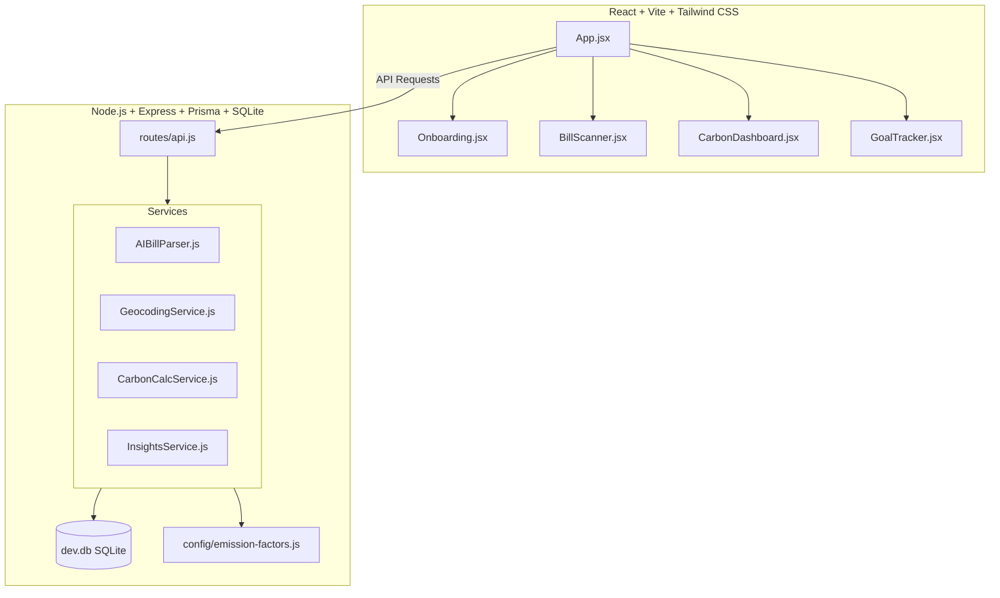

# EcoTrack - Zero-Effort Carbon Footprint Tracker

EcoTrack helps individuals understand, track, and reduce their carbon footprint using a **zero manual typing** model. The only two user actions are granting location permission and uploading a receipt. 

> **Core Flow:** Grant Location &rarr; Snap Receipt &rarr; Get Footprint (Zero Typing).

---

## 1. What It Does and Why

Manual tracking of carbon footprints is tedious and prone to abandonment. EcoTrack eliminates data entry:
1. **Onboarding**: Uses the **Browser Geolocation API** to fetch home coordinates, reverse-geocodes them via **OpenStreetMap Nominatim** to identify the user's country, and sets regional household emission factor averages.
2. **Scanning**: Scans receipt photos via AI (Gemini, OpenAI, or Anthropic vision models) or fallback local OCR (Tesseract.js).
3. **Calculations**: Geocodes the shop address, computes the travel distance from home, infers the transit mode, categorizes products, and computes the exact carbon footprint.
4. **Actionable Feedback**: Provides editable chips for corrections (never required) and suggests ranked, quantified monthly savings based on actual data.

---

## 2. Architecture Overview

EcoTrack is structured as a Monorepo split between `/client` and `/server`:



- **`/server/routes/api.js`**: Main HTTP routing layer.
- **`/server/services/`**: Isolated core logic (AIBillParser, GeocodingService, CarbonCalcService, InsightsService).
- **`/server/config/emission-factors.js`**: The single source of truth for carbon intensities and thresholds.
- **`/server/prisma/`**: Database persistence layer using SQLite.

---

## 3. Two-Command Setup

Bootstrap the entire application (database generation, seed data, server dependencies, and client builds) with two commands:

1. **Install and Bootstrap**:
   ```bash
   npm install
   ```
   *Note: This automatically triggers root, server, and client package installs, initializes Prisma SQLite database, pushes tables, and seeds 2 weeks of history.*

2. **Launch Dev Server**:
   ```bash
   npm run dev
   ```
   *This starts both the Express server (port 5000) and Vite client (port 3000) concurrently.*

---

## 4. Emission Factor Sources & Citations

All calculation factors are defined in `/server/config/emission-factors.js` and referenced from official environmental agencies:

- **Transport Footprints** (in kg CO₂e / km):
  - `transit`: **0.035** (UK DEFRA 2023 greenhouse gas conversion factors for average bus/rail).
  - `car`: **0.170** (US EPA eGRID & UK DEFRA petrol/diesel medium car average).
  - `flight`: **0.115** (IPCC Fifth Assessment Report average short/long haul passenger flight).
  - `walking`/`cycling`: **0.00** (Zero direct emissions).
- **Food & Product Categories** (in kg CO₂e / kg):
  - `meat`: **20.0** (Poore & Nemecek, Science 2018 - weighted average for beef ~60, pork ~7, poultry ~6).
  - `dairy`: **5.0** (Our World in Data food lifecycle estimates - cheese ~21, milk ~3).
  - `produce`: **0.8** (Our World in Data fruit, veg, and grain average).
  - `packaged_food`: **2.0** (DEFRA average processing intensity).
  - `household`: **1.2** (UK DEFRA household supplies lifecycle assessments).
  - `other`: **1.5** (Global average consumer product intensity fallback).
- **Home Energy Grid Defaults** (in kg CO₂e / kWh):
  - `US`: **0.370** (US EPA eGRID 2023 state averages).
  - `GB`: **0.150** (UK DEFRA 2023 grid emissions).
  - `IN`: **0.710** (India Central Electricity Authority carbon footprint reports).
  - `DEFAULT` (World Average): **0.475** (International Energy Agency grid averages).

---

## 5. How Calculations Work

Footprints are computed as:
$$\text{Total Footprint} = \text{Travel Emissions} + \text{Product Emissions}$$

### Travel Emissions
$$\text{Travel } (\text{kg CO}_2\text{e}) = \text{Haversine Distance (km)} \times \text{Transit Mode Factor (kg/km)}$$
Store distance is computed via the haversine formula using shop coordinates and home coordinates. Transit modes are automatically inferred on scan based on distance thresholds:
- $\le 1\text{ km}$: Inferred as `walking` (0 kg CO₂e)
- $1 \text{ to } 3\text{ km}$: Inferred as `cycling` (0 kg CO₂e)
- $3 \text{ to } 15\text{ km}$: Inferred as `transit` (0.035 kg/km)
- $> 15\text{ km}$: Inferred as `car` (0.170 kg/km)

### Product Emissions
$$\text{Product } (\text{kg CO}_2\text{e}) = \sum \left( \text{Item Quantity} \times \text{Category Factor (kg/kg)} \right)$$

---

## 6. API Key Setup

Configure external services in your local `.env` file (copy of `.env.example`):

```env
PORT=5000
NODE_ENV=development

# Choose: openai | gemini | anthropic
AI_PROVIDER=gemini
AI_API_KEY=your_vision_api_key_here

# Set to true for offline / demo mode using pre-parsed fixtures
DEMO_MODE=true
```

### Free Tiers and Limits:
- **Gemini (Recommended)**: Gemini 1.5 Flash offers a free tier (15 RPM / 1,500 RPD) which easily fits standard tracking.
- **OpenAI**: Requires a paid platform account with credits ($5 minimum).
- **Anthropic**: Requires commercial console credits.
- **Tesseract.js Fallback**: Used automatically if no API key is specified or if vision requests fail. Runs locally in-browser or on server.
- **EcoTrack Rate Limiter**: Server limits requests to **100 calls/day** to prevent accidental bill runs.

---

## 7. Privacy Note

EcoTrack prioritizes privacy. Coordinates collected via the browser Geolocation API are sent to the local server node and reverse-geocoded using OSM Nominatim. **Coordinates are stored locally on your machine in the SQLite DB (`dev.db`) and are never uploaded to cloud trackers, advertiser APIs, or external tracking services.**

---

## 8. Known Limitations & Submission Details

### Submission Size (Under 10 MB Target)
- The entire application source code, including documentation, configuration, and seeded database files, totals **less than 1.5 MB**.
- **Important:** When packaging this repository for submission, make sure to delete or exclude all `node_modules` folders (`/node_modules/`, `/client/node_modules/`, `/server/node_modules/`). Running `npm install` on the target machine will regenerate all dependencies automatically.

### Behavioral Limits
1. **Averages vs. Precision**: Using categorical emission averages (e.g. general produce vs. organic avocados imported by plane) trading precision for a zero-input user experience.
2. **errand-chaining**: The haversine formula computes a dedicated trip from home to store. It does not account for multi-stop commutes (e.g., stopping at a grocery store on the way home from work).
3. **OCR / Vision Variance**: Low-quality images, crumpled receipts, or bad lighting can affect AI accuracy. If JSON extraction fails, the system safely falls back to Tesseract OCR keyword matching.
4. **Single Local User**: The system is configured for a single, local developer environment.
   - *How to scale to multi-user*: Add user authentication (e.g. Passport.js, Firebase, or JWT session tokens), relate the `Log` and `User` models using a `userId` foreign key in the Prisma schema, and filter query responses on the server by the authenticated user's ID.

